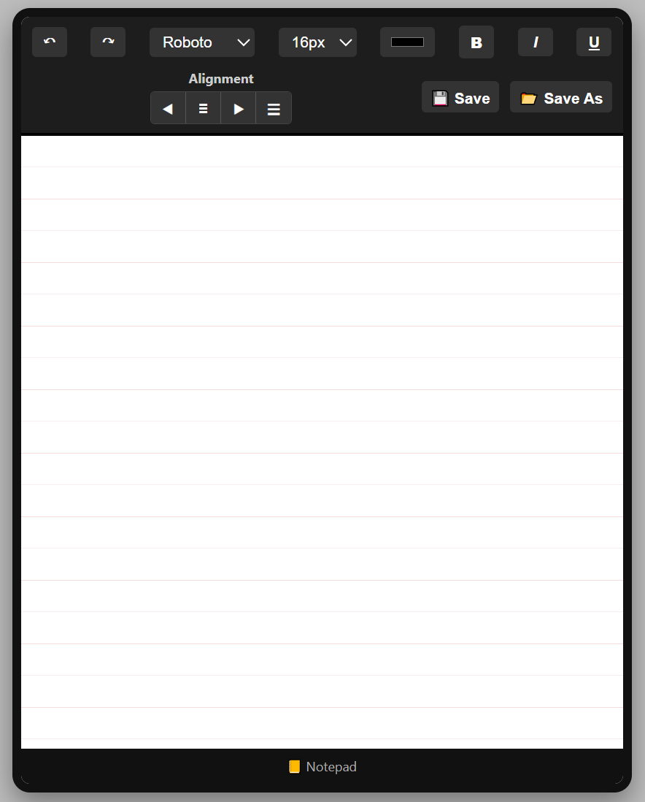

# 📒 Stylish Notepad UI

A simple and stylish notepad built with **HTML, CSS, and JavaScript**.  
It includes a lined-paper effect, text formatting tools, alignment options, and file save features.

---

## ✨ Features
- 📝 **Lined notepad design** (realistic paper effect)
- 🔄 **Undo / Redo** actions
- 🔠 Change **Font Family** and **Font Size**
- 🎨 Choose **Text Color**
- **Bold / Italic / Underline** support
- ⬅️ ⬍ ➡️ ☰ **Text alignment controls** (Left, Center, Right, Justify)
- 💾 **Save** (quick save as `notes.txt`)
- 📂 **Save As** (choose your own filename)

---

## 📸 Preview
  
*(Add a screenshot of your project here — name it `screenshot.png` in your repo root)*

---

## 🚀 How to Use
1. Clone this repository:
   ```bash
   git clone https://github.com/IBSpark/Notepad.git
